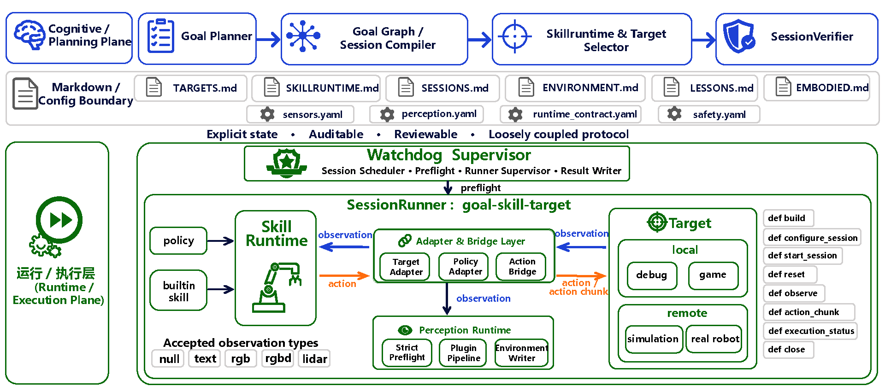

<div align="center">
  

  <h1>PhyAgentOS-G</h1>

  <h3>通用游戏智能体 —— 解耦式具身智能行为研究框架</h3>

  <p>
    <a href="./README.md">English</a> | <a href="./README_zh.md">中文</a>
  </p>

  <p>
    
    
    
    <a href="https://github.com/PhyAgentOS/PhyAgentOS">
      
    </a>
    <a href="https://github.com/PhyAgentOS/PhyAgentOS/stargazers">
      
    </a>
  </p>
  <br>
  <p>
    <sub>基于主分支 v0.1.4 重构迁移 · 专注于游戏智能体行为研究 · 支持仿真与真机验证</sub>
  </p>
</div>

---

## 📢 更新日志

| 版本 | 日期 | 更新内容 |
|:-----|:-----|:---------|
|  | 2026-06-12 | 支持自我反思的自进化机制，可以在未知场景完成复杂任务并总结经验 |
|  | 2026-06-11 | 整合为Agent Loop，支持复杂任务的完成 |
|  | 2026-05-29 | Minecraft 通路优化：支持终端和游戏内下达指令并执行 |
|  | 2026-05-29 | Minecraft 全链路就绪：云端 Agent 接入用户本地 Minecraft 服务器 |

> **v0.0.3 说明**：PhyAgentOS-G 基于 [PhyAgentOS 主分支 v0.1.4](https://github.com/PhyAgentOS/PhyAgentOS) 重构而来。保留了 Session-Centered Runtime 核心架构，并聚焦于游戏智能体的行为研究。版本号从 0.0.x 开始，以独立追踪 Game Agent 分支的演进。

---

## 🤔 为什么选择 PhyAgentOS-G？

将具身智能体的学习和验证迁移到游戏环境，以极低成本探索智能行为的核心能力——长期决策、空间推理、任务规划——然后将已验证的策略迁移到仿真与真机环境。

<table>
<tr><td width="32">🎮</td><td width="160"><b>低成本验证</b></td><td>游戏环境天然提供复杂交互、长期记忆依赖和开放世界，无需硬件成本即可迭代 Agent 能力。</td></tr>
<tr><td>🔄</td><td><b>游戏→仿真→真机</b></td><td>同一套 Session 协议在 game / simulation / real_robot 三类 target 上无差别运行，零摩擦迁移。</td></tr>
<tr><td>📋</td><td><b>全程可审计</b></td><td>状态、动作、感知结果以 Markdown + YAML 落盘，每一步可追溯复现。</td></tr>
<tr><td>🧩</td><td><b>三段解耦架构</b></td><td>RolloutTarget + SkillRuntime + TargetAdapter 分离，新增游戏/硬件只需 ~100 行代码。</td></tr>
</table>

<br>

<div align="center">
  
  <p><sub>▲ Session-Centered Runtime 架构全览</sub></p>
</div>

---

## ✨ 核心特性

<table>
<tr>
  <td width="32">🔄</td>
  <td width="160"><b>Session-Centered Runtime</b></td>
  <td><code>WatchdogSupervisor</code> → <code>SessionRunner</code> → <code>SkillRuntime</code> → <code>TargetSessionHandle</code> 执行链路，以 Session 为核心调度单元</td>
</tr>
<tr>
  <td>🎯</td>
  <td><b>Target-Configured</b></td>
  <td><code>game</code> / <code>debug</code> / <code>simulation</code> / <code>real_robot</code> 四类 target，<code>TARGETS.md</code> 统一注册，adapter 按需挂载</td>
</tr>
<tr>
  <td>🧩</td>
  <td><b>Adapter + Bridge</b></td>
  <td><code>TargetAdapter</code> + <code>PolicyAdapter</code> + <code>ActionBridge</code> 三段解耦，显式声明 observation/action 契约；<code>AdapterPlan</code> 自动编排</td>
</tr>
<tr>
  <td>⚡</td>
  <td><b>双轨 Skill 运行时</b></td>
  <td><code>PolicySkillRuntime</code> 维护策略闭环 + <code>BuiltinSkillRuntime</code> 管理 Agent 交互闭环</td>
</tr>
<tr>
  <td>🛡️</td>
  <td><b>Strict Preflight</b></td>
  <td>运行时前置校验（target / sensor / perception / adapter contract / action contract / tool），不合格直接 <code>rejected</code></td>
</tr>
<tr>
  <td>📝</td>
  <td><b>文件协议矩阵</b></td>
  <td><code>TARGETS.md</code> · <code>SKILLRUNTIME.md</code> · <code>SESSIONS.md</code> · <code>ENVIRONMENT.md</code> · <code>LESSONS.md</code> + 外部 YAML</td>
</tr>
<tr>
  <td>🔐</td>
  <td><b>多层安全</b></td>
  <td>Critic 校验 → Preflight 契约检查 → Target 端 SafetyGuard</td>
</tr>
<tr>
  <td>🎮</td>
  <td><b>Game Agent CLI</b></td>
  <td><code>paos minecraft</code> 命令行直接控制 Minecraft bot，支持 16 种动作类型</td>
</tr>
</table>

---

## 🚀 5 分钟快速开始

<table>
<tr>
<td width="28" align="center">1</td>
<td>

**安装**

```bash
git clone https://github.com/PhyAgentOS/PhyAgentOS.git && cd PhyAgentOS
pip install -e .            # Python ≥ 3.11
```
</td>
</tr>
<tr>
<td align="center">2</td>
<td>

**初始化工作区**

```bash
paos onboard
```
</td>
</tr>
<tr>
<td align="center">3</td>
<td>

**启动 Agent**

```bash
paos agent --workspace workspaces/minecraft
```
</td>
</tr>
<tr>
<td align="center">4</td>
<td>

**运行第一个任务**

```bash
paos agent "来到我身边"
```
</td>
</tr>
<tr>
<td align="center">5</td>
<td>

**可选：agent 视角观察**

```bash
...
```

**可选：仿真场景验证**

```bash
...
```

**可选：真机场景验证**

```bash
...
```

</td>
</tr>
</table>

---

## 🗂️ 协议文件

| 进入上下文逻辑 | 文件 | 所属工作区 | 功能 |
|:--|:--|:--|:--|
| 始终进入 agent system prompt | `AGENTS.md` / `SOUL.md` / `USER.md` | Agent workspace | Agent 运行规则、身份边界、用户偏好 |
| 始终进入 agent system prompt | `TOOLS.md` | Agent workspace | 工具使用规则与可用工具说明 |
| 始终进入 agent system prompt | `SKILLS.md` | Agent workspace | 面向 Agent 的 skill 发现与加载规则 |
| 存在时进入上下文；涉及 target 时按启用 target 过滤 | `EMBODIED.md` | Agent workspace | Target 能力的人类可读描述 |
| 存在时作为状态进入上下文 | `ENVIRONMENT.md` | Agent/runtime workspace | 当前 target、场景与环境状态 |
| 存在时作为记忆/状态进入上下文 | `LESSONS.md` | Agent workspace | 运行经验、失败记录与修正建议 |
| 存在时作为任务状态进入上下文 | `TASK.md` | Agent workspace | 多步任务拆解与进度 |
| Runtime 协议；创建 session 前读取 | `TARGETS.md` | Runtime workspace | 已启用 target、endpoint/adapter/config、支持的 skill runtime |
| Runtime 协议；创建 session 前读取 | `SKILLRUNTIME.md` | Runtime workspace | Policy/builtin skill runtime 注册表与执行契约 |
| Runtime 队列/状态；Agent 与 watchdog 写入 | `SESSIONS.md` | Runtime workspace | 待执行、执行中、已完成 session 与结果 |

`SKILLS.md` 服务 Agent 能力与 skill 发现；`SKILLRUNTIME.md` 服务 runtime 执行契约，并与 `TARGETS.md`、`SESSIONS.md` 配套使用。

---

## 📦 项目结构

```
PhyAgentOS-G/
│
├── PhyAgentOS/agent/          # Track A — Agent 大脑
│   ├── loop.py                #   主 Agent 循环
│   ├── context.py             #   上下文窗口构建
│   ├── memory.py              #   短期/长期记忆系统
│   ├── skills.py              #   Skill 加载与执行
│   └── tools/                 #   内置工具（文件、Shell、Web 等）
│
├── PhyAgentOS/runtime/        # Track B — 执行平面
│   ├── watchdog/              #   WatchdogSupervisor · Session 调度
│   ├── sessions/              #   SessionRunner · TargetSessionHandle
│   ├── targets/               #   RolloutTarget（game · debug · sim · real）
│   │   ├── game/              #   Minecraft game target
│   │   ├── local/             #   DummySimTarget 冒烟测试
│   │   ├── remote/libero/     #   LIBERO benchmark TargetWS server + proxy
│   │   ├── sim/               #   仿真 target（开发中）
│   │   └── real/              #   真机 target（开发中）
│   ├── skillruntime/          #   PolicySkillRuntime · BuiltinSkillRuntime
│   │   ├── policy/            #   OpenPI policy runtime (pi05)
│   │   └── game/              #   Minecraft skill runtime
│   ├── adapters/              #   TargetAdapter · PolicyAdapter · Bridge
│   │   ├── libero/            #   LIBERO target adapter
│   │   ├── openpi/            #   OpenPI policy adapters
│   │   └── minecraft/         #   Minecraft adapter
│   ├── policy/openpi/         #   OpenPI client · LeRobot pi0-family server
│   ├── perception/            #   感知运行时 · EnvironmentWriter
│   ├── preflight/             #   RuntimeCompatibilityPreflight
│   ├── schemas/               #   Pydantic Session/Contract Schema
│   └── workspace/             #   Runtime workspace 生命周期管理
│
├── PhyAgentOS/cli/            # CLI 入口（paos agent / onboard / minecraft）
├── PhyAgentOS/skills/         # Agent 内置 Skills（benchmarking 等）
├── PhyAgentOS/config/         # Pydantic 配置模型
├── PhyAgentOS/templates/      # 工作区模板（TARGETS.md / SESSIONS.md 等）
│   └── configs/runtime/       # Sensor / Perception / Contract YAML
├── scripts/                   # 工具脚本（E2E 验收、workspace 初始化）
├── bridge/                    # TypeScript 桥接层
├── docs/                      # 文档（中英文）
│   ├── zh/                    #   中文文档
│   ├── en/                    #   英文文档
│   └── scenarios/game/        #   Minecraft 部署与使用指南
└── pyproject.toml             # Python 包配置
```

---

## 🏷️ 支持目标

| | Kind | 位置 | 示例 | 状态 |
|:--|:-----|:-----|:-----|:-----|
| 🎮 | `game` | Local | Minecraft | ✅ 已支持 |
| 🧪 | `simulation` | Remote | LIBERO benchmark + pi0.5 policy | ✅ 已支持 |

> 全部 target 通过 `TARGETS.md` 统一注册，`target_adapter://` URI 标识 adapter。

---

## 📖 文档

| 文档 | 面向 | 说明 |
|:-----|:-----|:-----|
| [框架介绍](docs/zh/01-framework-introduction.md) | 所有人 | 设计理念、技术架构、当前进展、路线图 |
| [用户手册](docs/zh/02-user-manual.md) | 使用者 | 安装部署、游戏/仿真场景运行、排障指南 |
| [开发者手册](docs/zh/03-developer-manual.md) | 开发者 | API 接口、Target/Adapter/Skill 开发、代码风格 |
| [Minecraft 部署指南](docs/scenarios/game/minecraft/zh/deployment.md) | 使用者 | Windows bridge + Linux Agent 完整部署流程 |
| [Minecraft 使用指南](docs/scenarios/game/minecraft/zh/usage.md) | 使用者 | CLI 控制、对话监听、踩坑记录 |

---

## 🤝 参与贡献

欢迎提交 PR 和 Issue。

---

<div align="center">

基于 **[nanobot](https://github.com/HKUDS/nanobot)** 构建

**PhyAgentOS-G** 是 [PhyAgentOS](https://github.com/PhyAgentOS/PhyAgentOS) 的 Game Agent 分支

由 **中山大学 HCP 实验室** 与 **鹏城实验室** 联合开发

<br>


&nbsp;&nbsp;&nbsp;

&nbsp;&nbsp;&nbsp;


<br>
<sub>MIT License · Copyright © 2025-2026 PhyAgentOS</sub>

</div>
