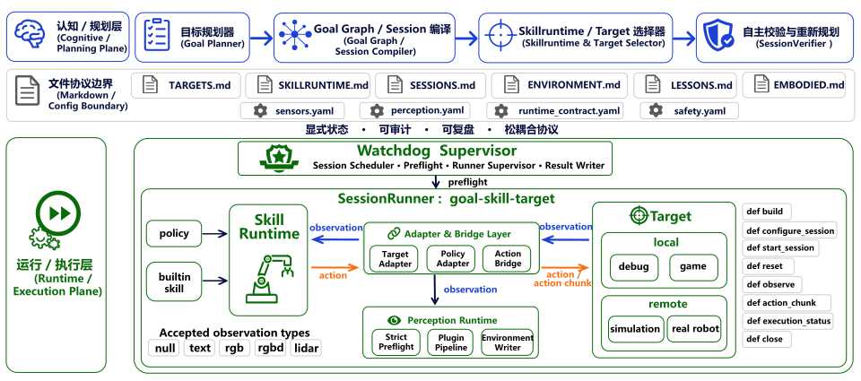
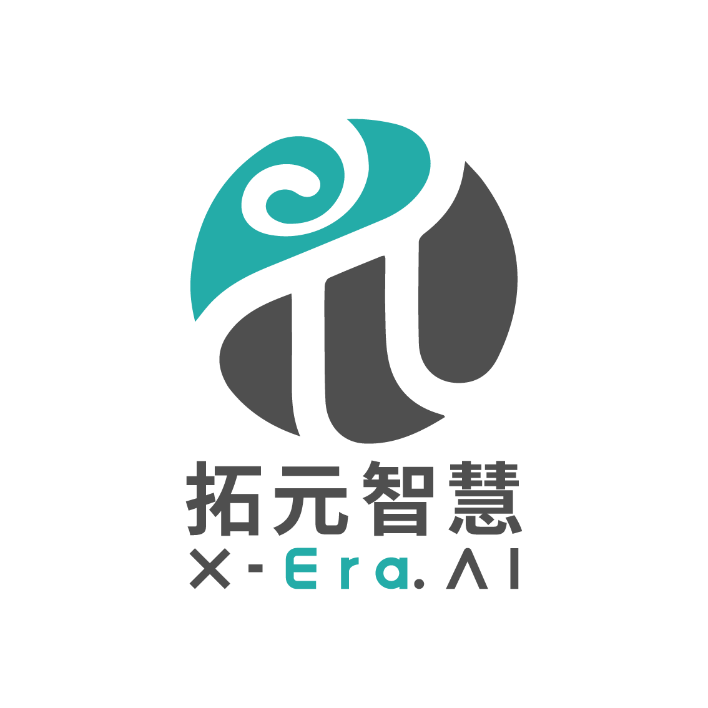

<div align="center">
  

  <h3>认知与物理解耦 —— 面向具身智能的 Session-Centered 运行时</h3>

  <p>
    <a href="https://github.com/PhyAgentOS/PhyAgentOS/stargazers">
      
    </a>
    <a href="https://github.com/PhyAgentOS/PhyAgentOS/network/members">
      
    </a>
  </p>
  <p>
    
    
    <a href="https://sysu-hcp-eai.github.io/PhyAgentOS-website/">
      
    </a>
    <a href="https://github.com/PhyAgentOS/PhyAgentOS">
      
    </a>
  </p>
  <p>
    <sub><a href="./README.md">English</a> · <a href="./README_zh.md">中文</a></sub>
  </p>
</div>

---

## 📢 更新日志

| 版本 | 日期 | 更新内容 |
|:-----|:-----|:---------|
|  | 2026-06-27 | 支持 Behavior 1K Benchmark；用于 Agent 校验的 SessionVerfier; VerifySessionTool|
|  | 2026-06-11 | 清理协议文件及文档，game 场景分离至 `general-game-agent` 分支独立推进；当前分支聚焦仿真 & 真机重构 |
|  | 2026-06-5 | 优化用户友好的启动流程; 通信协议规范; 更合理的代码规范; Game Agent & Benchmarking 就绪 |
|  | 2026-05-25 | `PolicySkillRuntime` / `BuiltinSkillRuntime` 边界严格分离，Game Agent & Benchmarking 就绪 |
|  | 2026-05-20 | 感知插件体系：`SensorConfig` / `PerceptionConfig` YAML + `EnvironmentWriter` 可审计写回 |
|  | 2026-05-18 | Session-Centered Runtime MVP：`DummySimTarget` + `DummyAdapter` + `DummyClient` 串行链路 |
|  | 2026-04-29 | Hackathon 基线：插件化 HAL，ReKep / SAM3 真机抓取与 VLN 全链路 |

---

## 🤔 为什么选择 PhyAgentOS？

传统的"大模型直连硬件"方案高度耦合，换一个机器人就要重写整个执行链路。PhyAgentOS 通过 **认知-物理解耦 + Session-Centered Runtime** 彻底改变了这一点：

<table>
<tr><td width="32">🔌</td><td><b>同代码，万硬件</b> — 新增机器人只需实现一个 Target Adapter（~100 行），调度层零改动。</td></tr>
<tr><td>🛡️</td><td><b>三道安全防线</b> — Critic 校验 → Strict Preflight → Target-side SafetyGuard，真机场景不可绕过。</td></tr>
<tr><td>📋</td><td><b>全程可审计</b> — 状态、动作、感知结果以 Markdown + YAML 落盘，每一步可追溯复现。</td></tr>
<tr><td>🔄</td><td><b>零摩擦迁移</b> — 同一套 Session 协议在 sim / real 2类 target 上无差别运行。</td></tr>
</table>

<br>

<div align="center">
  
  <p><sub>▲ Session-Centered Runtime 架构全览</sub></p>
</div>

---

## ✨ 核心特性

<table>
<tr>
  <td width="32">🔄</td>
  <td width="160"><b>Session-Centered Runtime</b></td>
  <td><code>WatchdogSupervisor</code> → <code>SessionRunner</code> → <code>SkillRuntime</code> → <code>TargetSessionHandle</code> 执行链路，抛弃 Driver-Center 旧架构</td>
</tr>
<tr>
  <td>🎯</td>
  <td><b>Target-Configured</b></td>
  <td> <code>debug</code> / <code>simulation</code> / <code>real_robot</code> 三类 target，<code>TARGETS.md</code> 统一注册，adapter 按需挂载</td>
</tr>
<tr>
  <td>🧩</td>
  <td><b>Adapter + Bridge</b></td>
  <td><code>TargetAdapter</code> + <code>PolicyAdapter</code> + <code>ActionBridge</code> 三段解耦，并显式声明 observation/action 契约；<code>AdapterPlan</code> 自动编排，消灭 target×skill 组合爆炸</td>
</tr>
<tr>
  <td>⚡</td>
  <td><b>双轨 Skill 运行时</b></td>
  <td><code>PolicySkillRuntime</code> 维护 policy 闭环 + <code>BuiltinSkillRuntime</code> 管理 agent 交互闭环</td>
</tr>
<tr>
  <td>🛡️</td>
  <td><b>Strict Preflight</b></td>
  <td>运行时前置校验（target / sensor / perception / adapter contract / action contract / tool），不合格直接 <code>rejected</code></td>
</tr>
<tr>
  <td>📝</td>
  <td><b>文件协议矩阵</b></td>
  <td><code>TARGETS.md</code> · <code>SKILLRUNTIME.md</code> · <code>SESSIONS.md</code> · <code>ENVIRONMENT.md</code> · <code>LESSONS.md</code> + 外部 YAML</td>
</tr>
<tr>
  <td>🔐</td>
  <td><b>多层安全</b></td>
  <td>Critic 校验 → Preflight 契约检查 → Target-side SafetyGuard → Operator Override</td>
</tr>
<tr>
  <td>🌐</td>
  <td><b>Fleet 模式</b></td>
  <td>多机器人协同，shared + per-robot 工作区，优先级串行调度</td>
</tr>
</table>

---

## 🚀 5 分钟快速开始

<table>
<tr>
<td width="28" align="center">1</td>
<td>

**安装**

```bash
git clone https://github.com/PhyAgentOS/PhyAgentOS.git && cd PhyAgentOS
pip install -e .            # Python ≥ 3.11
pip install -e ".[dev]"     # 开发依赖
```
</td>
</tr>
<tr>
<td align="center">2</td>
<td>

**初始化工作区**

```bash
paos onboard
```
</td>
</tr>
<tr>
<td align="center">3</td>
<td>

**启动 Agent**

```bash
paos agent
```
</td>
</tr>
<tr>
<td align="center">4</td>
<td>

**可选：连接 Runtime 服务**

```bash
# LIBERO benchmark TargetWS 机器
MUJOCO_GL=egl PYTHONWARNINGS=ignore \
conda run -n liberopi python PhyAgentOS/runtime/targets/remote/libero/server.py \
  --host 0.0.0.0 --port 9002

# pi0.5 policy 机器
conda run -n lerobot-pi python -m PhyAgentOS.runtime.policy.openpi.lerobot_pi0_server \
  --model-dir /path/to/pi05/checkpoint --host 0.0.0.0 --port 8000
```
</td>
</tr>
</table>

当 config 启用 runtime 时，`paos agent` 和 `paos gateway` 会自动创建
runtime workspace，并启动 session watchdog。Runtime target 由
`TARGETS.md` 声明，可执行运行时由 `SKILLRUNTIME.md` 声明；Agent 通过向
`SESSIONS.md` 追加 session 来排队执行任务。

```bash
paos agent -m "运行已配置的 LIBERO benchmark 任务"
```

---

## 🗂️ 协议文件

| 进入上下文逻辑 | 文件 | 所属工作区 | 功能 |
|:--|:--|:--|:--|
| 始终进入 agent system prompt | `AGENTS.md` | Agent workspace | Agent 的项目级运行规则 |
| 始终进入 agent system prompt | `SOUL.md` | Agent workspace | 身份、行为边界与助手风格 |
| 始终进入 agent system prompt | `USER.md` | Agent workspace | 用户偏好与长期画像 |
| 始终进入 agent system prompt | `TOOLS.md` | Agent workspace | 工具使用规则与可用工具说明 |
| 始终进入 agent system prompt | `SKILLS.md` | Agent workspace | 面向 Agent 的 skill 发现与加载规则 |
| 存在时进入上下文；涉及 target 时按启用 target 过滤 | `EMBODIED.md` | Agent workspace | Target 能力的人类可读描述 |
| 存在时作为状态进入上下文，不是 bootstrap 规则 | `ENVIRONMENT.md` | Agent/runtime workspace | 当前 target、场景与环境状态 |
| 存在时作为记忆/状态进入上下文 | `LESSONS.md` | Agent workspace | 运行经验、失败记录与修正建议 |
| 存在时作为任务状态进入上下文 | `TASK.md` | Agent workspace | 多步任务拆解与进度 |
| Runtime 协议；创建 session 前读取 | `RUNTIME.md` | Runtime workspace | 写入合法 runtime session 的说明 |
| Runtime 协议；创建 session 前读取 | `TARGETS.md` | Runtime workspace | 已启用 target、endpoint/adapter/config 引用、支持的 skill runtime |
| Runtime 协议；创建 session 前读取 | `SKILLRUNTIME.md` | Runtime workspace | Policy/builtin skill runtime 注册表与执行契约 |
| Runtime 队列/状态；Agent 与 watchdog 写入 | `SESSIONS.md` | Runtime workspace | 待执行、执行中、已完成 session 与结果 |

`SKILLS.md` 服务 Agent 能力与 skill 发现；`SKILLRUNTIME.md` 服务 runtime
执行契约，并与 `TARGETS.md`、`SESSIONS.md` 配套使用。

---

## 📦 项目结构

```
PhyAgentOS/
│
├── PhyAgentOS/agent/          # Track A  ─  Planner / Critic / Memory
│
├── PhyAgentOS/runtime/        # Track B  ─  执行平面
│   ├── watchdog/              #   WatchdogSupervisor
│   ├── sessions/              #   SessionRunner / TargetSessionHandle
│   ├── targets/               #   RolloutTarget (debug·sim·real)
│   │   └── remote/libero/     #   LIBERO benchmark TargetWS server + proxy
│   ├── skillruntime/          #   PolicySkillRuntime / BuiltinSkillRuntime
│   ├── adapters/              #   TargetAdapter / PolicyAdapter / Bridge
│   │   ├── libero/            #   LIBERO target adapter
│   │   └── openpi/            #   OpenPI policy adapters
│   ├── policy/openpi/         #   OpenPI client + LeRobot pi0-family server
│   ├── perception/            #   感知运行时 / EnvironmentWriter
│   ├── preflight/             #   RuntimeCompatibilityPreflight
│   └── schemas/               #   Pydantic Schema
│
├── configs/runtime/           # Sensor / Perception / Contract YAML
├── scripts/                   # 工具脚本
├── workspace/                 # Agent 工作区；runtime 文件可按配置共用该目录
├── docs/                      # 文档
└── tests/                     # 测试
```

---

## 🏷️ 支持目标

| | Kind | 位置 | 示例 |
|:--|:-----|:-----|:-----|
| 🐛 | `debug` | Local | echo / mock / dry-run —— 零硬件验证协议链路 |
| 🧪 | `simulation` | Remote | RoboCasa、LIBERO —— Benchmark 评测与批量经验挖掘 |
| 🤖 | `real_robot` | Remote | Franka、Go2、XLeRobot、AgileX PIPER —— 真实运行 |

> 全部 target 通过 `TARGETS.md` 统一注册，`target_adapter://` URI 标识 adapter。
> 更多实例与演示 → [项目网站](https://phy-agent-os.net/)

---

## 📖 文档

| 文档 | 面向 | 说明 |
|:-----|:-----|:-----|
| [🌐 项目网站](https://phy-agent-os.net/docs/en/architecture.html) | 所有人 | 完整文档、架构详解、Demo 演示 |
| [📘 用户手册](https://phy-agent-os.net/docs/en/api-reference.html) | 使用者 | 安装部署、运行操作指南 |
| [📙 开发指南](https://phy-agent-os.net/docs/en/developer-guide.html) | 开发者 | 二次开发、硬件接入、插件编写 |

---

## 🤝 参与贡献

欢迎提交 PR 和 Issue，我们的开发计划可以在此处查看👉 [开发计划](https://phy-agent-os.net/docs/en/developer-guide.html)。

---

<div align="center">

由 **中山大学 HCP 实验室**、**鹏城实验室** 与 **拓元智慧** 联合开发

<br>


&nbsp;&nbsp;&nbsp;

&nbsp;&nbsp;&nbsp;


<br>
<sub>MIT License · Copyright © 2025-2026 PhyAgentOS</sub>

</div>
